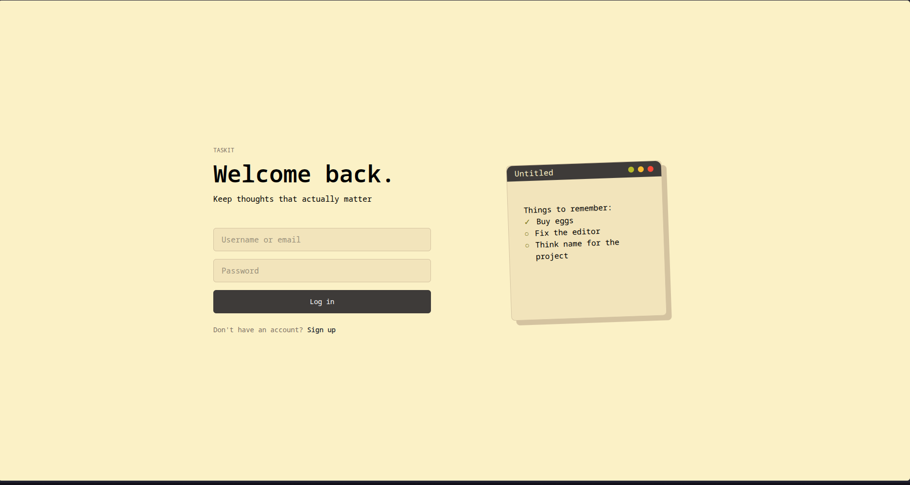
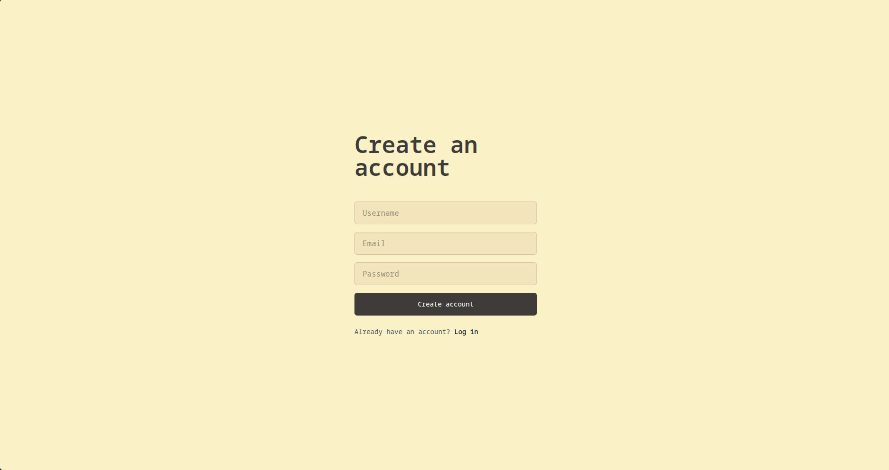
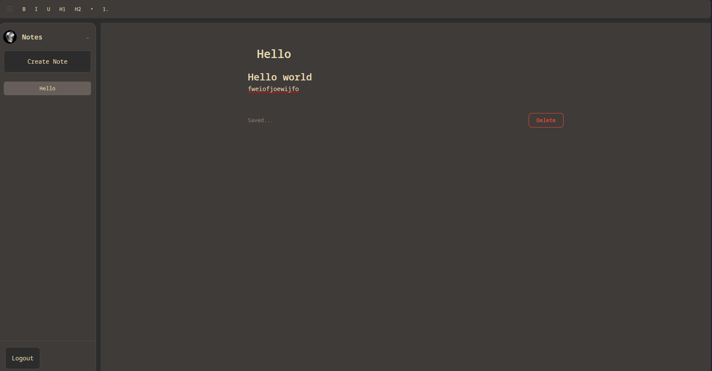
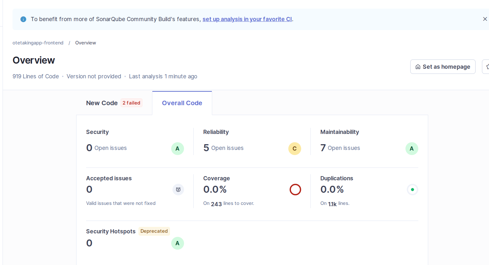
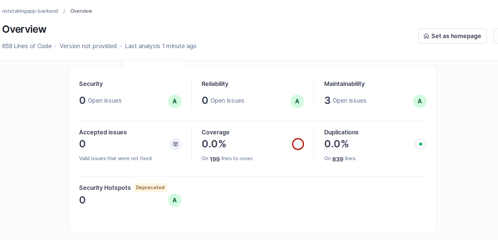

# Notes App

A small full stack application built as an internship during 10pearls cohort 9. 
The project follows an easy schema, with string[] based notes with integrations
with tip tap for proper text editing and markdown support.

## Screenshots

### Login



### Signup



### Notes / Dashboard Page



### SonarQube

Sonarqube "issues" are mostly removing unused imports or removing nesting as refactors marked differently
in reliability and maintainability

**Frontend:**




---

**Backend:**



## Features

- User authentication
- Rich text editing using Tip-Tap
- Create, update, delete documents
- auto-saving


## Tech Stack

- Express
- React
- Prisma
- MySQL / MariaDB

## Project Structure

```

./
├── backend
│   ├── package.json
│   ├── package-lock.json
│   ├── prisma
│   │   ├── adapter.ts
│   │   ├── generated
│   │   │   └── prisma
│   │   │       ├── browser.ts
│   │   │       ├── client.ts
│   │   │       ├── commonInputTypes.ts
│   │   │       ├── enums.ts
│   │   │       ├── internal
│   │   │       │   ├── class.ts
│   │   │       │   ├── prismaNamespaceBrowser.ts
│   │   │       │   └── prismaNamespace.ts
│   │   │       ├── models
│   │   │       │   ├── Note.ts
│   │   │       │   ├── RefreshToken.ts
│   │   │       │   └── User.ts
│   │   │       └── models.ts
│   │   ├── migrations
│   │   │   └── 20260803104134_replace_blocks_with_plain_notes
│   │   │       └── migration.sql
│   │   ├── prisma.config.ts
│   │   └── schema.prisma
│   ├── routes.http
│   ├── sonar-project.properties
│   ├── src
│   │   ├── app.ts
│   │   ├── controllers
│   │   │   ├── authControllers.ts
│   │   │   └── notesController.ts
│   │   ├── middleware
│   │   │   ├── auth_middleware.ts
│   │   │   ├── error_middleware.ts
│   │   │   └── zod_middleware.ts
│   │   ├── routes
│   │   │   ├── auth.ts
│   │   │   └── notes.ts
│   │   ├── server.ts
│   │   ├── services
│   │   │   └── logger.ts
│   │   ├── tests
│   │   │   ├── auth.test.ts
│   │   │   ├── helpers.ts
│   │   │   └── notes.test.ts
│   │   ├── types
│   │   │   └── types.ts
│   │   └── zod
│   │       ├── auth_schema.ts
│   │       └── note_schema.ts
│   └── tsconfig.json
├── docker-compose.sonar.yml
├── frontend
│   ├── babel.config.cjs
│   ├── index.html
│   ├── package.json
│   ├── package-lock.json
│   ├── sonar-project.properties
│   ├── src
│   │   ├── api
│   │   │   └── axios.ts
│   │   ├── App.tsx
│   │   ├── assets
│   │   │   ├── favicon.ico
│   │   │   └── logo.png
│   │   ├── components
│   │   │   └── ProtectedRoute.tsx
│   │   ├── context
│   │   │   └── AuthContext.tsx
│   │   ├── env.d.ts
│   │   ├── handlers
│   │   │   ├── authHandlers.ts
│   │   │   └── noteHandlers.ts
│   │   ├── index.css
│   │   ├── main.tsx
│   │   ├── pages
│   │   │   ├── Dashboard.tsx
│   │   │   ├── LoginPage.tsx
│   │   │   └── SignupPage.tsx
│   │   ├── tests
│   │   │   ├── dashboard.test.tsx
│   │   │   ├── login.test.tsx
│   │   │   ├── setup.ts
│   │   │   └── signup.test.tsx
│   │   └── types
│   │       ├── auth.ts
│   │       └── notes.ts
│   ├── tsconfig.app.json
│   ├── tsconfig.json
│   ├── tsconfig.node.json
│   └── vite.config.ts
├── README.md
└── schema.md

```

